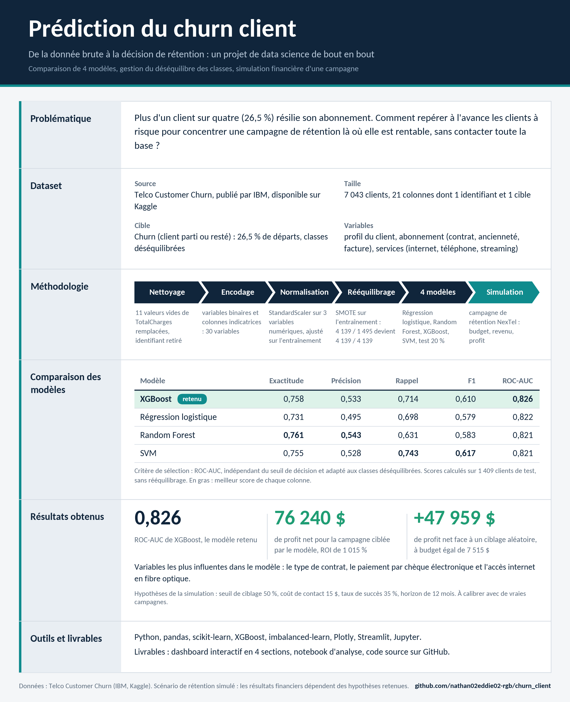

# Projet Churn Client — De A à Z



Projet complet de prédiction du churn client (attrition), avec comparaison de 4 modèles
de Machine Learning, gestion du déséquilibre des classes, normalisation, et une simulation
business réelle (bilan financier d'une campagne de rétention) restituée dans un dashboard.

## 1. Éléments du projet (démarche)

| Étape | Contenu |
|---|---|
| 1. Cadrage | Définir la cible (`Churn`), les variables disponibles, le critère métier (coût d'un faux négatif = client perdu, coût d'un faux positif = campagne gaspillée) |
| 2. Données | Dataset **Telco Customer Churn** (IBM / Kaggle, ~7 043 clients, 21 variables) |
| 3. Nettoyage | Traitement des valeurs manquantes (`TotalCharges`), suppression de l'identifiant |
| 4. Encodage | Variables binaires → `LabelEncoder`, variables multi-catégories → one-hot encoding |
| 5. Normalisation | `StandardScaler` sur `tenure`, `MonthlyCharges`, `TotalCharges` |
| 6. Déséquilibre des classes | `SMOTE` (sur-échantillonnage synthétique de la classe minoritaire) appliqué **uniquement sur le train** |
| 7. Modélisation | 4 modèles comparés : Régression Logistique, Random Forest, XGBoost, SVM |
| 8. Évaluation | Accuracy, Précision, Rappel, F1-score, ROC-AUC — sélection du meilleur modèle |
| 9. Cas d'usage métier | Simulation d'une campagne de rétention chez une entreprise fictive **NexTel** : budget dépensé, revenu récupéré, profit net, ROI, comparé à un ciblage aléatoire |
| 10. Restitution | Dashboard Python (Streamlit interactif + export HTML statique autonome) |

## 2. Structure du projet

```
churn_project/
├── data/
│   └── Telco-Customer-Churn.csv        # dataset source (IBM/Kaggle)
├── src/
│   ├── preprocessing.py                # nettoyage, encodage, normalisation, split
│   ├── train_models.py                 # entraînement + comparaison des 4 modèles + SMOTE
│   ├── business_simulation.py          # simulation financière de la campagne de rétention
│   ├── generate_static_dashboard.py    # génère un dashboard HTML autonome (Plotly)
│   └── make_summary_image.py           # génère l'image de synthèse du projet (PNG et JPEG)
├── models/
│   ├── best_model.joblib               # meilleur modèle (XGBoost) sauvegardé
│   ├── scaler.joblib / encoders.joblib / feature_names.joblib
│   └── best_model_name.json
├── outputs/
│   ├── comparaison_modeles.csv/.png    # tableau et graphique de comparaison des modèles
│   ├── courbes_roc.png
│   ├── matrice_confusion.png
│   ├── importance_variables.csv/.png
│   ├── bilan_business.json/.png        # bilan financier de la campagne
│   ├── predictions_test_set.csv
│   ├── resume_projet_churn.png / .jpg  # tableau de synthèse du projet
│   └── dashboard_nextel.html           # dashboard exportable, un seul fichier
├── dashboard/                          # application Streamlit en 4 sections
│   ├── app.py                          # point d'entrée et navigation
│   ├── theme.py / data.py              # identité visuelle, chargement des données en cache
│   ├── views/                          # problematique.py, dataset.py, kpi.py, predictions.py
│   └── .streamlit/config.toml          # thème (couleurs)
├── notebooks/
│   └── projet_churn_client.ipynb       # notebook complet (EDA -> ML -> business), exécuté
├── requirements.txt
├── .gitignore
└── README.md
```

## 3. Le dashboard Streamlit

L'application est organisée en quatre sections :

| Section | Contenu |
|---|---|
| Problématique | Enjeu du churn, question posée, coût des départs, démarche, résultat en bref |
| Dataset | Description du jeu Telco, aperçu filtrable, dictionnaire des variables, préparation (nettoyage, encodage, normalisation, SMOTE) |
| Visualisations KPI | Churn par contrat, internet, ancienneté et paiement ; performance des 4 modèles ; bilan financier interactif de la campagne |
| Prédictions | Score de départ d'un client avec facteurs explicatifs et pistes d'action, liste des clients à risque, scoring d'un fichier CSV |

## 4. Installation et exécution

```bash
pip install -r requirements.txt

# 1) Entraîner et comparer les 4 modèles
cd src
python preprocessing.py          # test du pipeline de données
python train_models.py           # entraîne, compare, sauvegarde le meilleur modèle

# 2) Lancer la simulation business
python business_simulation.py

# 3) Générer le dashboard HTML autonome (exportable, un seul fichier)
python generate_static_dashboard.py
# -> ouvre outputs/dashboard_nextel.html dans un navigateur

# 4) Lancer le dashboard interactif Streamlit (depuis le dossier dashboard/)
cd ../dashboard
streamlit run app.py

# 5) Régénérer l'image de synthèse du projet
cd ../src
python make_summary_image.py
```

## 5. Résultats obtenus (échantillon de test, 1 409 clients)

| Modèle | Accuracy | Précision | Rappel | F1-score | ROC-AUC |
|---|---|---|---|---|---|
| **XGBoost (retenu)** | 0.758 | 0.533 | 0.714 | 0.610 | **0.826** |
| Régression Logistique | 0.731 | 0.495 | 0.698 | 0.579 | 0.822 |
| Random Forest | 0.761 | 0.543 | 0.631 | 0.583 | 0.821 |
| SVM | 0.755 | 0.528 | 0.743 | 0.617 | 0.821 |

**XGBoost** est retenu car il offre le meilleur ROC-AUC (pouvoir de discrimination global),
un critère plus robuste que la simple accuracy sur un problème déséquilibré (~26,5% de churn).

## 6. Cas d'usage métier — NexTel (scénario par défaut)

Hypothèses : seuil de ciblage = 50%, coût de contact = 15$/client, taux de succès de la
campagne = 35%, horizon de valeur = 12 mois.

| Indicateur | Avec modèle ML | Sans modèle (ciblage aléatoire) |
|---|---|---|
| Clients ciblés | 501 | 501 |
| Budget engagé | 7 515 $ | 7 515 $ |
| Revenu récupéré | 83 755 $ | 35 796 $ |
| **Profit net** | **76 240 $** | 28 281 $ |
| ROI | 1 015 % | 376 % |

➡️ Le ciblage par le modèle génère **+47 959 $** de profit net supplémentaire par rapport
à une campagne non ciblée, pour un budget strictement identique — la valeur du modèle vient
de sa **précision de ciblage** (53,3% de vrais clients à risque parmi les clients contactés,
contre 26,5% en ciblage aléatoire).

Tous les paramètres (seuil, coût, taux de succès, horizon) sont ajustables dynamiquement
dans la section Visualisations KPI du dashboard Streamlit.

## 7. Notebook

Le notebook `notebooks/projet_churn_client.ipynb` reprend l'ensemble de la démarche de façon
narrative et exécutée (EDA, nettoyage, encodage, normalisation, SMOTE, entraînement des 4
modèles, sélection du meilleur, puis simulation business NexTel) — pratique pour explorer,
présenter ou modifier le projet pas à pas.

```bash
jupyter notebook notebooks/projet_churn_client.ipynb
```

## 8. Limites et pistes d'amélioration
- Le taux de succès de campagne (35%) et le coût de contact (15$) sont des hypothèses de
  travail à calibrer avec des données réelles de campagnes passées.
- Un réglage fin des hyperparamètres (GridSearch/Optuna) et un seuil de décision optimisé
  (au lieu de 0,5 par défaut) amélioreraient encore la précision du ciblage.
- Ajout possible d'un module de "raisons de churn" (feature importance par client, SHAP)
  pour personnaliser l'offre de rétention.
